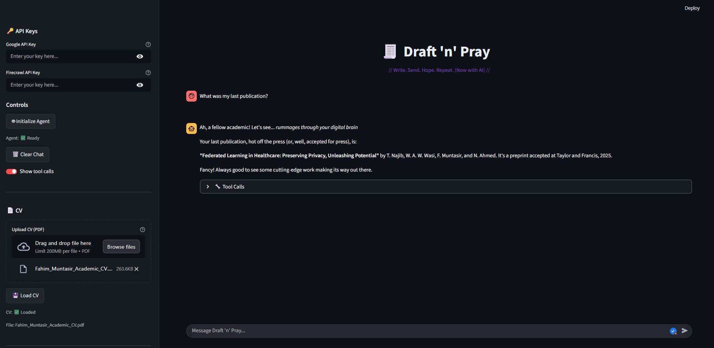

# 🧾 Draft 'n' Pray - AI Mail Writer

> Write. Send. Hope. Repeat. (Now with AI)

A powerful AI-powered email writing assistant that helps you craft personalized emails using your CV and web research. Available in two flavors: **CLI Tool** and **Streamlit Web UI**.



## 🚀 Features

- **AI-Powered Email Generation** - Uses advanced LLMs to craft personalized emails
- **CV Integration** - Upload your CV for personalized content based on your experience
- **Web Research** - Crawl websites to gather information about companies, labs, or opportunities
- **Smart Tool Usage** - Automatically selects the right tools for your request
- **Streaming Responses** - Real-time token streaming for better user experience
- **Clean Interface** - Minimal, ChatGPT-like UI that focuses on content

## 🛠️ Two Ways to Use

### Option 1: CLI Tool (Command Line)

Perfect for developers and power users who prefer command-line interfaces.

```bash
# Install dependencies
pip install -r requirements.txt

# Set environment variables
export GOOGLE_API_KEY="your_google_api_key"
export FIRECRAWL_API_KEY="your_firecrawl_api_key"

# Run the CLI tool
python run.py
```

**CLI Features:**
- Fast command-line interface
- Easy integration with scripts and automation
- Lightweight and efficient
- Perfect for batch processing

### Option 2: Streamlit Web UI

Beautiful web interface that anyone can use, perfect for deployment and sharing.

```bash
# Install dependencies
pip install -r requirements.txt

# Run the Streamlit app
streamlit run streamlit_app.py
```

**Web UI Features:**
- Beautiful dark theme with coding fonts
- Interactive sidebar for configuration
- Real-time streaming responses
- Tool call visibility toggle
- CV upload and management
- Deployable to Streamlit Cloud

## 🔑 Setup

### Required API Keys

1. **Google API Key** - For Gemini LLM access
   - Get it from [Google AI Studio](https://makersuite.google.com/app/apikey)
   
2. **Firecrawl API Key** - For web crawling capabilities
   - Get it from [Firecrawl](https://firecrawl.dev/)

### Environment Variables

**For CLI Tool:**
```bash
export GOOGLE_API_KEY="your_key_here"
export FIRECRAWL_API_KEY="your_key_here"
```

**For Streamlit UI:**
- Enter your API keys directly in the sidebar
- No environment variables needed!

## 📁 Project Structure

```
mail_writer_agent/
├── run.py                 # CLI tool entry point
├── streamlit_app.py       # Streamlit web UI
├── agent.py              # Core agent logic
├── tools.py              # Tool definitions (CV search, web crawling)
├── model.py              # LLM model configuration
├── system_prompt.py      # Agent system prompt
├── ui_theme.py           # Streamlit UI theme
├── requirements.txt      # Python dependencies
└── images/               # Banner images and assets
    └── streamlit_banner.png
```

## 🚀 Quick Start

### CLI Tool
```bash
# 1. Clone the repository
git clone <your-repo-url>
cd mail_writer_agent

# 2. Install dependencies
pip install -r requirements.txt

# 3. Set API keys
export GOOGLE_API_KEY="your_key"
export FIRECRAWL_API_KEY="your_key"

# 4. Run
python run.py
```

### Streamlit UI
```bash
# 1. Clone the repository
git clone <your-repo-url>
cd mail_writer_agent

# 2. Install dependencies
pip install -r requirements.txt

# 3. Run Streamlit
streamlit run streamlit_app.py

# 4. Open browser and enter your API keys in the sidebar
```

## 💡 Example Prompts

- **Email Generation**: "Crawl https://prof-site.edu and write an email to the professor about joining their lab"
- **CV Analysis**: "What are my programming languages?" or "Summarize my work experience"
- **Research**: "Find the latest publications from this research group"

## 🌐 Deployment

### Streamlit Cloud
1. Push your code to GitHub
2. Connect your repo to [Streamlit Cloud](https://streamlit.io/cloud)
3. Deploy automatically
4. Users can input their own API keys in the web interface

### Other Platforms
- **Heroku**: Use the Streamlit buildpack
- **Railway**: Deploy with Railway's Python support
- **Vercel**: Use Vercel's Python runtime

## 🔧 Customization

- **System Prompt**: Modify `system_prompt.py` to change agent behavior
- **Tools**: Add new tools in `tools.py`
- **UI Theme**: Customize the interface in `ui_theme.py`
- **Model**: Change LLM provider in `model.py`

## 🚨 Troubleshooting

### Common Issues

#### 1. **Embedding Engine Errors**
If you see errors like `module 'google.genai' has no attribute 'configure'`:

```bash
# Test your setup
python test_imports.py

# Update dependencies
pip install --upgrade google-genai langchain-google-genai

# Check API key format
# Google API keys should start with "AI" and be ~40 characters long
```

#### 2. **CV Loading Fails**
- Ensure your Google API key is valid and has sufficient quota
- Check that the PDF file is not corrupted
- Verify your internet connection
- Try the "Test Embedding Engine" button in the Streamlit UI

#### 3. **API Key Issues**
- **Google API Key**: Must be from [Google AI Studio](https://aistudio.google.com/)
- **Firecrawl API Key**: Optional, only needed for web crawling
- Keys are stored locally in your browser session
- Clear and re-enter keys if you encounter issues

#### 4. **Dependency Issues**
```bash
# Clean install
pip uninstall -r requirements.txt
pip install -r requirements.txt

# Check Python version (3.8+ required)
python --version
```

### Testing Your Setup

Run the test script to verify everything works:
```bash
python test_imports.py
```

This will check:
- ✅ All required imports
- ✅ Google GenAI connectivity
- ✅ LangChain integration
- ✅ Embedding engine creation

## 📝 License

[Your License Here]

## 👨‍💻 Creator

**Fahim Muntasir**  
📧 muntasirfahim.niloy@gmail.com

---

*Built with ❤️ using LangGraph, Streamlit, and modern AI technologies*
